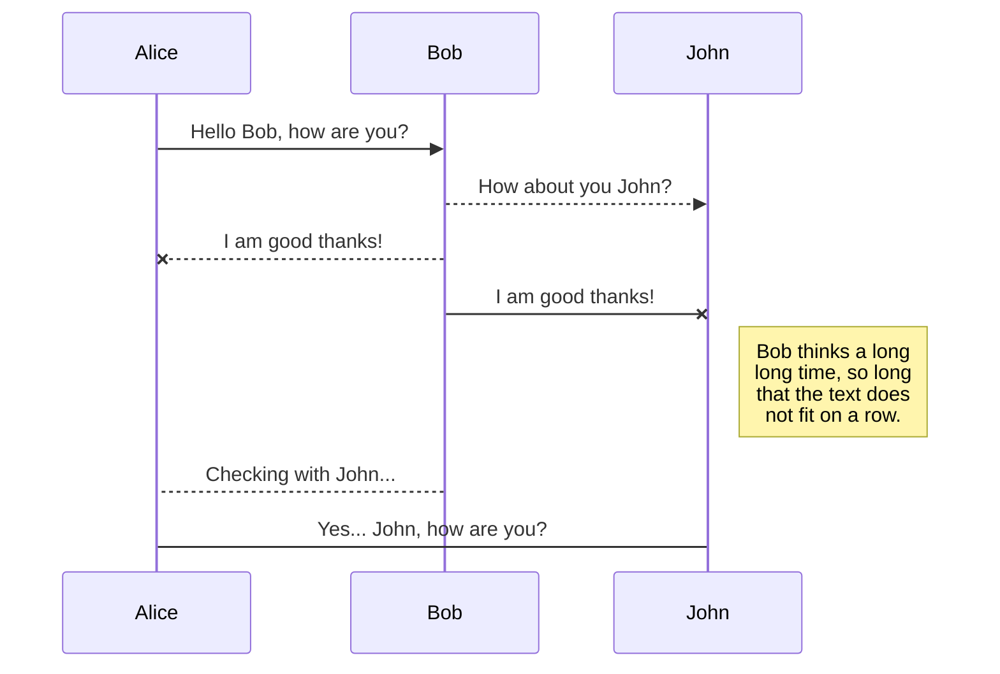

# README


### Lien
 **https://github.com/infinitydev4/emporte_moi**
 **https://emportemoi.herokuapp.com**
 

### Le Projet
Nous sommes partis du constat que **la malnutrition touche de nombreux étudiants pour diverses raisons** (budget, temps, compétences, équipements...) tandis que les ménages et les restaurants collectifs cuisinent trop pour leur propre consommation. Nous avons donc pensé à une solution : **une plateforme de mise en relation sur laquelle les ménages et les restaurants collectifs peuvent vendre leur part en trop à des prix accessibles aux étudiants**.

Enactus UN est une association  qui apporte un soutien aux  étudiants  pour mener à bien leurs projets d'entreprenariat social et solidaire. **Emporte-moi** est l'un de ces projets.
Il a pour but :
- d'un côté **améliorer la nutrition des étudiants**
- et d'un autre côté **diminuer le gaspillage alimentaire au sein des ménages et des restaurants collectifs**.

### L'équipe
Notre dream-team de Nantes est composée de:
  * **Bertyn**
    * 19 ans / 
  * **Florian**
    * 19 ans / 
  * **Lionel**
    * 19 ans / 
  * **Mohamed**
    * 19 ans / 
  * **Nicolas**
    * 19 ans / 


> Dédicace au Lieu Unique, à la Fac de Sciences et à nos ordis à bout de souffle, sans qui tout celà n'aurait pas été possible.

###### Ready ? Passes aux toilettes, prends-toi une petite boisson, installes-toi confortablement. C'est parti !

### Méthodologie et répartition
 ##### Done
 - [1] Un dossier Github qui contient une application Rails qui contient tout
 - [2] Un README.md qui explique toute l'application, comment s'en servir, les différents liens de production, les opérations utilisées, etc
 - [3] Du Front
 - [4] Du Back-end
 - [5] Du Devise
 - [6] Du Mailjet
 - [7] Du Stripe
 - [8] De l'Active Storage 
 - [9] Du Google Analytics
 - [10] Du Google Maps
 - [11] Du Bootstrap
 - [12] Du 
 - [13] Du 
 - [..] Quelques tests : regarde Capybara pour les tests d'intégrations
 - ...
 

### Méthodologie et répartition

| Membre | Poste  | Partie  | Taf  |
| ------ | ------ | ------ | ------ |
| Bertyn | pivot (center) | [1], [2], [3] [4], [7],[8]| Stripe hero |
| Florian | meneur (point guard)| [1], [3], [4], [5], [6], [10],| Lead developper |
| Lionel | ailier (small forward)]| [1], [2], [3]| Markdown monk |
| Mohamed |arrière (shooting guard) | [1], [3], [9] [11]| Css warrior |
| Nicolas | ailier fort (power forward)| [1], [4], [5]| Bugs sorcerer |

### Ressources

ruby '2.5.1'
rails '5.2.1'

* [Rails](https://rubyonrails.org/) - On ne le presente plus

### Gemfile

| gem | info  |
| ------ | ------ |
| gem 'bootstrap' | https://github.com/twbs/bootstrap-rubygem |
| gem 'jquery-rails' | https://github.com/rails/jquery-rails |
| gem 'devise' | https://github.com/plataformatec/devise |
| gem 'dotenv-rails' | https://github.com/bkeepers/dotenv |
| gem 'stripe' | https://github.com/stripe/stripe-ruby |
| gem 'mailjet' | https://github.com/mailjet/mailjet-gem |
| gem 'geocoder' | https://github.com/alexreisner/geocoder |
| gem 'gmaps4rails' | https://github.com/MrRuru/Gmaps4rails |


# Lancement :
```sh
$ git clone https://
$ bundle install
$ rails db:create
$ rails db:migrate
$ rails db:seed
```


